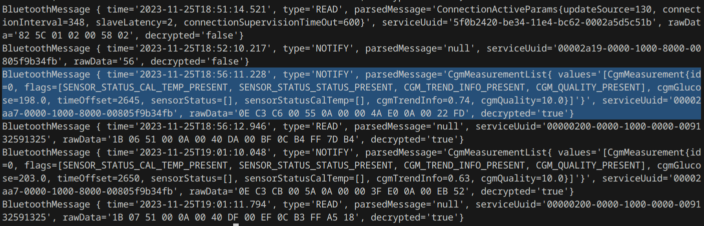

# OpenGuardian

Reverse engineering the BT communication for the Medtronic Guardian Continous Glucose Monitoring Systems and Insulin Pumps. This work originally started on the Guardian 4 Sensor, but now the insulin pumps are also being researched. Check the discord for more info! https://discord.gg/tb4egy8VYh (no Medtronic spies please)

- [OpenGuardian](#openguardian)
  - [Structure](#structure)
  - [JADX notes](#jadx-notes)
    - [finding the converter map](#finding-the-converter-map)
  - [Monitor script](#monitor-script)
  - [Random notes](#random-notes)

## Structure
- Jadx_Projects: 
  - it contains the [JADX](https://github.com/skylot/jadx) projects to reverse engineer the APK contents  
- OpenGuardian4
   - the Java code for parsing and decoding already decrypted BT messages. 
   - this is intended to be used in an Android app hopefully in the forseable future

  - limited support for UUIDs, but can also parse some Guardian 4 messages
  - the "4" will be dropped from the name and support will be added for Guardian 3, and the Pumps
- Sake_RE
  - the [Ghidra](https://github.com/NationalSecurityAgency/ghidra) project to reverse engineer the Medtronic's crypto library called *SAKE* ([see more](data/sake_whitepaper.pdf)) 
  - progress has been stated, but it is in its early stages
  - currently using an older version of the library built for ARMv7
- Sakeproxy
  - an Android application which uses the prebuilt SAKE libraries extracted from the original APKs
  - it provides a simple HTTP API and it can be used to perform the crypto functions without an actual device
  - only a temporary solution until we can fully reverse enginer the crypto library, but will be very useful for development
  - also I am planning on hosting some kind of development server for other people to talk with their devices
- Data 
	- decrypted SAKE "key databases"
	- logs from the Monitor script
	- UUID information
	- sniffed BT traffic in pcap format
  - TODO: document everything, maybe create a wiki on github
- Scripts
  - various scripts to be used with frida (including the Monitor)
  - TODO: go trough the old backups and upload everything
- Tools
  - log_decrypt
    - the app contains functionality to dump decrypted logs into a zip file for debugging with Medtronic's email support (???)
    - the algorithm has been reversed, after manually patching the public key in the APK, it can be decrypted and will contain juicy info for reversing
  - db_decrypt
    - scripts to dump the AndroidKeyStore, where the keys are stored for the app's databases
  - minimal API for CareLink Cloud
    - I have reversed the API where the data upload/download takes place
    - the code now has been integrated in some open-source projects, this is just a mirror (see  [carelink-python-client](https://github.com/ondrej1024/carelink-python-client), [xDripCareLinkFollower](https://github.com/benceszasz/xDripCareLinkFollower/))
  - other scripts used for dev
  - TODO: sort out scripts used for MITM

## JADX notes
1. get the Guardian apk here: https://m.apkpure.com/guardian%E2%84%A2/com.medtronic.diabetes.guardian/download
	(md5sum of the original file: 865d1872c197c073830c02416d63f294)
2. place it in the project's root folder under the name "Guardian_134.apk"
3. get jadx from here: https://github.com/skylot/jadx/releases
4. open the project
5. start reversing: you will mostly need just two buttons: X for references, N for rename, and also the search menu

### finding the converter map

1.  **just search for classes > ConverterMap** 

or from sketch:

1. look for a uuid string of a gatt service (for example "00000202-0000-1000-0000-009132591325".
2. there should be 1/2 results, check the call for the super
3. look for an injection of a class into an interface, thats the target class
4. right click on the class > find usage, and find a class which maps other classes, starting with Void, String, Byte[] to other random classes
5. those are the conveters and the target classes that we are interested in

## Monitor script

Usage: 

0. get a rooted android phone
1. download frida server (https://frida.re/docs/android)
3. connect to adb via usb & install frida on your phone
4. start your frida server as root on the device
5. edit the beginning of the monitor.js script to select your app version  
6. `frida -U -f com.medtronic.diabetes.guardian -l guardianmon.js` (you can stack additional scripts to bypass the security checks like: `-l bypass_developer.js`)
7. save the output to a txt file and use OpenGuardian to parse them

## Random notes
- If the app is patched it will NOT be able to receive the SAKE keys, because PlayIntegrity will detect it but MITM is still possible for login and the "Teneo secure communications" (after some Frida scripts)
