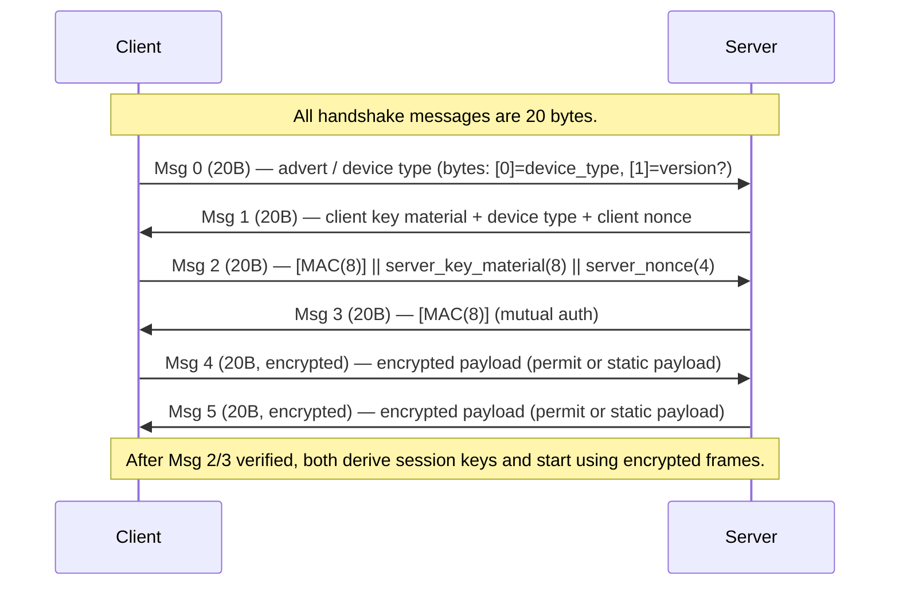

## Keys

Our current understanding is that the keys are static between devices and each device type has a key pair. We have currently extracted a few of these, which did not require dumping the devices flash memories.

## Quick notes

- msg 1:
  - client_key_material = rand()
  - client_nonce = rand()

- msg 2:
	- server_key_material = rand() ?  generated by the client
	- mac is calculated with handshake_auth_key (it comes from the key db)

- msg 3:
  - handshake_auth_key is used

- msg 4
	- derivation_key comes from key db

	- session key = ecb(derivation_key, client material + server key material) 

	- now traffic is encrypted using session key

	- we send double encrypted permit payload

	- decrypt using session key, decrypt using key db's permit_decrypt_key

	- then we calculate and check cmac using permit_auth_key

> [!WARNING]  
> This is a lazy AI autogenerated documentation from now!

## Overview

- Auth primitives: AES-CMAC and AES-ECB/CTR
- Static keys (stored in a KeyDatabase) contain:
  - `derivation_key` (16 bytes)
  - `handshake_auth_key` (16 bytes)
  - `permit_decrypt_key` (16 bytes)
  - `permit_auth_key` (16 bytes)
  - `handshake_payload` (16 bytes)

The protocol performs a 6-message handshake to authenticate both parties and derive a symmetric session key for AES-CTR payload encryption with a small, embedded MAC scheme.

## High-level message sequence

## Message field details

- Msg0 (checked by `handshake_0_s`): 20 bytes; `msg[1]` expected == 1; `msg[0]` taken as a device type indicator.

- Msg1 (parsed by `handshake_1_c`):
  - `client_key_material` = bytes 0..7 (8B)
  - `client_device_type` = byte 8
  - `client_nonce` = bytes 9..12 (4B)

- Msg2 (parsed by `handshake_2_s`):
  - `received_mac` = bytes 0..7 (8B)
  - `server_key_material` = bytes 8..15 (8B)
  - `server_nonce` = bytes 16..19 (4B)
  - `received_mac` is verified with CMAC-AES-8 over the message `server_key_material || client_key_material || derivation_key` using `handshake_auth_key` (see `auth8`).

- Msg3 (parsed by `handshake_3_c`):
  - Client computes `auth1 = CMAC(handshake_auth_key, msg=(server_key_material||client_key_material||derivation_key))` (8B).
  - `inner = auth1.digest() || server_key_material || derivation_key` (32B)
  - Server's Msg3 contains CMAC-AES-8 over `inner`; client verifies first 8 bytes.

## Key derivation and ciphers

- Once Msg2/Msg3 succeed the code derives the session cipher key:
  - `session_key = AES-ECB(derivation_key).encrypt(server_key_material || client_key_material)` — 16 bytes.
- Nonce material: `nonce = client_nonce || server_nonce` (8 bytes total). SeqCrypt then constructs a per-message CTR nonce as `seq (5 bytes) || nonce (8 bytes)` before left-padding to 16 bytes for CMAC.

## Encrypted frame format (SeqCrypt)

- Each encrypted frame structure (as used in `SeqCrypt.decrypt`) is:
  - `ciphertext || seq_byte || mac_first2bytes`
  - Total trailer size = 3 bytes where:
    - `seq_byte` = transmitted sequence indicator (see sequence math below)
    - `mac_first2bytes` = the first two bytes of a 4-byte CMAC tag

- Verification steps performed on receive:
  1. Compute `d = (msg[-3] - (self.seq // 2)) & 0xFF`
  2. Compute `seq = self.seq + 2*d` and build `nonce = seq.to_bytes(5,'big') || self.nonce`
  3. Compute `c = CMAC-AES-4(key)` over `nonce.ljust(16, b'\0') || ciphertext`
  4. Reconstruct the full 4-byte tag by concatenating `msg[-2:]` (two bytes sent) with `c.digest()[2:4]` (the computed last two bytes), then call `cobj.verify(...)`.
  5. If verification succeeds, set `self.seq = seq + 2` and decrypt `ciphertext` with AES-CTR using `nonce`.

Notes:
- The scheme transmits only the first two bytes of the 4-byte CMAC and reconstructs the trailing two bytes from the computation. This provides a 2-byte on-the-wire tag with a 4-byte internal check.
- Sequence numbering encodes the counter in the single `seq_byte` field as a delta relative to the receiver's `self.seq//2`.

## Permit / payload semantics

- After session keys are set, handshake messages 4 and 5 carry a 16-byte encrypted payload (after decryption):
  - If the decrypted payload equals a device's `handshake_payload` (from static keys), it's logged as a payload match.
  - Otherwise, the receiver attempts to decrypt payload with `permit_decrypt_key` (AES-ECB) to obtain a 16-byte `plain` value with structure:
    - `plain[:12]` = permit data
    - `plain[12:16]` = CMAC-AES-4 tag computed with `permit_auth_key` over `plain[:12]`
    - The code checks `plain[0] == 0` and `plain[1] == prover_device_type` to match device type.

## Implementation notes and observations

- `auth8(...)` builds a CMAC-AES object with `mac_len=8` and uses the `handshake_auth_key` to MAC the concatenation `server_key_material || client_key_material || derivation_key`.
- The session key derivation uses AES-ECB encryption with the 16-byte `derivation_key` of the concatenated 16 bytes `server_key_material||client_key_material` (8+8).
- `SeqCrypt` expects an 8-byte static nonce (client_nonce||server_nonce) and uses a 5-byte sequence counter embedded into the CTR nonce.
- Message trailers are only 3 bytes; the design trades authenticity bandwidth for message size by sending only 2 bytes of the MAC and reconstructing the rest on the verifier side.

