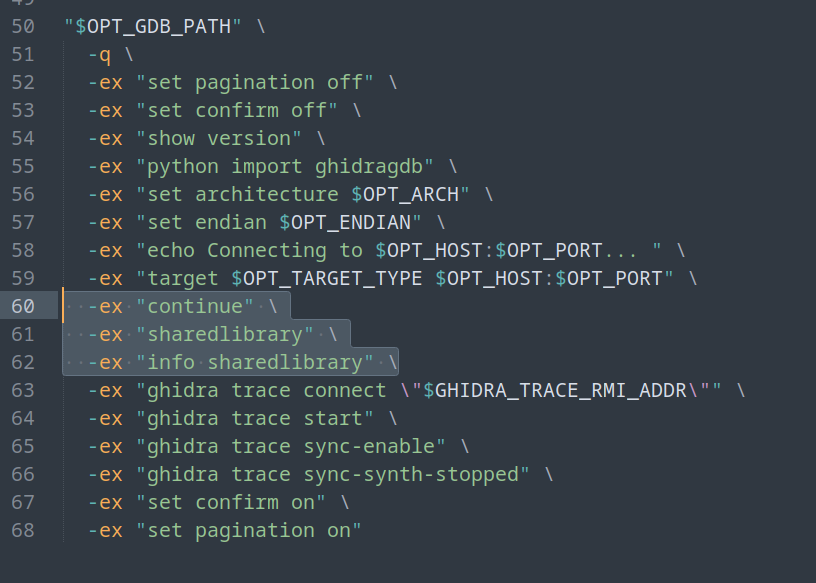

# Sake reversing notes 

- [Sake reversing notes](#sake-reversing-notes)
  - [How to debug sake with ghidra](#how-to-debug-sake-with-ghidra)
  - [Hooking with frida](#hooking-with-frida)
  - [GDB cheatsheet](#gdb-cheatsheet)
  - [Relocated address stuff](#relocated-address-stuff)
  - [ABI mismatch](#abi-mismatch)
  - [Ghidra workaround for connection timeout](#ghidra-workaround-for-connection-timeout)
  - [Ghidra speed improvement](#ghidra-speed-improvement)
  - [Ghidra no modules fix](#ghidra-no-modules-fix)

## How to debug sake with ghidra

1. cd NativeSakeRE
2. python startdebug.py
3. open ghidra's debugger
4. drag & drop the so file in
5. menu > debugger > configure & launch ... > gdb remote
6. port = 5555, arch = armv7, endianness auto
7. wait a little until you have modules loaded
8. you can go to modules > find sake.so > right click > map to your ghidra file
9.  clicking on an exported function should take you to its memory contents inside RAM
10. you should check if the bytes are the same, if yes you are good to go, you can set breakpoints now

## Hooking with frida
- may be a good idea but i wanted to check out ghidra: https://stackoverflow.com/a/68335254
  - well it was not really feasible, but the hot reloading of scripts without app restart was pretty good 

## GDB cheatsheet
- info sharedlibrary sake*
- info functions sake*
- info reg
- info b(reakpoints)
- continue
- disassemble funcname
- dump binary memory /tmp/dump.bin 0x200000000 0x20000c350
- set auto-solib-add 0
- python exec(open("sigbreak.py").read())
- x/20xbw 0xe7974810
- set scheduler-locking on
- b dlclose
- b Java_com_medtronic_minimed_sake_SakeJNI_Sake_1KeyDatabase_1Open
  
## Relocated address stuff
- if the app says "pairing timeout reached" it will re-load the library and the addresses will change
- i cant even calculate the new addresses by hand for some reason, maybe im just dumb but it is always in a different space (ASLR + some loader black magic???)
	- manually dumping the code segment and searching for the the raw bytes is the workaround for now

## ABI mismatch
- for some reason i thought it would be a cool idea to start reversing the armv7 binary instead of the aarch64
  - it was smaller in code and the decomp was way better (maybe link time optimization?)
- luckily we can use a hack to force the armv7 to load: just reinstall the apk with adb install --abi armeabi-v7a xyz.apk

## Ghidra workaround for connection timeout
- https://github.com/NationalSecurityAgency/ghidra/issues/7866#issuecomment-2695646126

## Ghidra speed improvement
close this window in ghidra for speed improvement 

## Ghidra no modules fix
- if you attach to gdb via ghidra before loading the shared library in the process AND before executing "sharedlibrary" command, ghidra will not be very usable
- fix is to add some lines into <code>/opt/ghidra/Ghidra/Debug/Debugger-agent-gdb/data/debugger-launchers/remote-gdb.sh</code> (or what have you)  
  - i added a SIGINT breakpoint in the code after loading the lib, so i can go from the entry breakpoint, then break, load the symbols and only AFTER that, connect to the ghidra gui